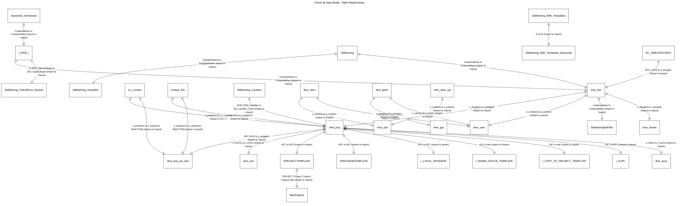

# Power BI Data Model - Table Relationships

## Legend

### Relationship Symbols
- `||--||` : One-to-One
- `||--o{` : One-to-Many
- `}o--o{` : Many-to-Many

### Storage Modes
- **Import**: Data cached in memory
- **DirectQuery**: Live connection to source
- **Dual**: Can use Import or DirectQuery

### Relationship Status
- **[INACTIVE]**: Relationship exists but not active
