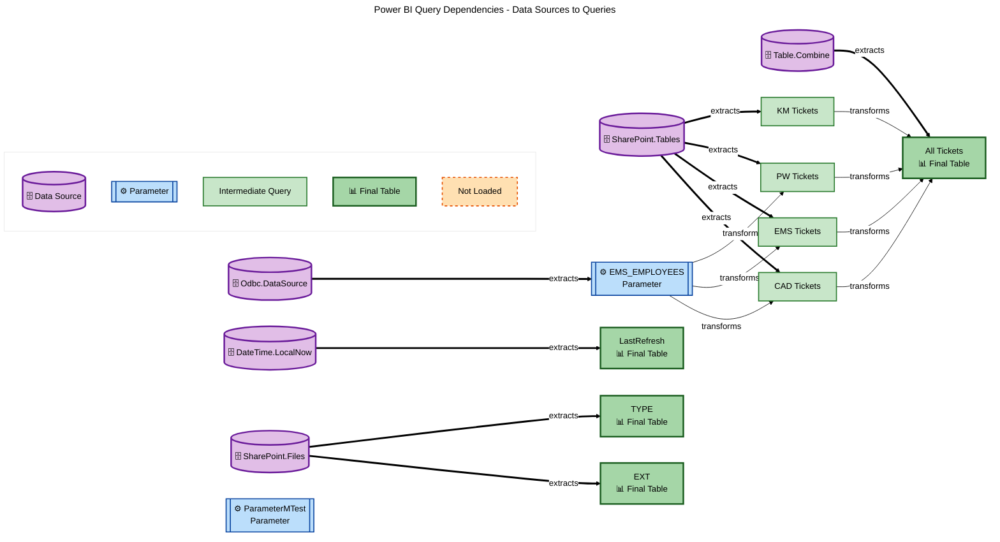

# Power BI Query Dependencies - Data Sources to Queries

## Legend

### Node Types
- 🗄️ **Purple Box (Data Source)**: External data source (SharePoint, SQL, etc.)
- ⚙️ **Blue Box (Parameter)**: M Parameter used in queries
- **Light Green Box (Intermediate Query)**: Query that transforms data and is referenced by other queries
- 📊 **Dark Green Box (Final Table)**: Query loaded into the data model
- **Orange Dashed Box (Not Loaded)**: Query that exists but is not loaded to the model

### Arrow Types
- `==> extracts`: Data extracted from source
- `--> transforms`: Query transforms another query

### Flow Direction
Data flows from **left to right**: Data Source → Query → Final Table
